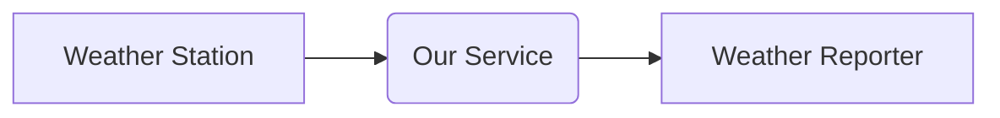
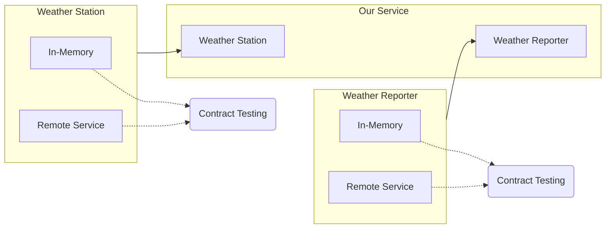
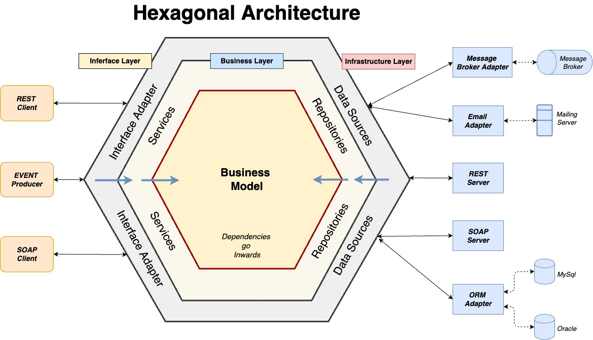

This repo demonstrates an example of using the _hexagonal_/_ports and adaptors_/_onion_ architecture and the advantages it provides for making testing easier. In particular this focuses on an example of using contract testing to verify that in-memory implementations (sometimes referred to as "fakes") have the equivalent behaviour of the external services; which can then be used to make unit testing easier.

Overview of the Domain
======================

Our service retrieves the current weather data from Weather Station, it then adds a comment based on the current weather data, which it then sends to a Weather Reporter service.



Overview of Architecture
========================

We can create equivalent in-memory implementations of the external services for use in unit tests. Contract tests are created to verify that both the in-memory and live service implementations have the same behaviour i.e. they conform to the same contract.



I offer a hand-drawn diagram as the Mermaid rendering engine currently isn't rendering a sensible diagram:


Now that we've *proven* that both implementations obey the same contract. We can then use the in-memory implementations in unit-testing!

Ports and Adapters (Hexagonal) Architecture
===========================================



From _What's Hexagonal Architecture?_ by [Luis Soares](https://medium.com/@luishrsoares/whats-hexagonal-architecture-6da22d4ab600)

Running the demo
================

In this repo, we emulate remote services via Docker and Docker Compose. In real life, these would be remote services that your service interacts with, but only exist remotely i.e. cannot be spun up locally for local development.

Navigate to our service at [our-service/](our-service/).

```bash
cd our-service
```

Next start up the remote services:

```bash
npm run start-services
```

Finally we can start up our service. Note that you need to provide the base URLs of the remote services via the following environment variables:
* `REMOTE_WEATHER_STATION_URL`
* `REMOTE_WEATHER_REPORTER_URL`

The default values are provided below (see [containerization/docker-compose.yaml](containerization/docker-compose.yaml) for further configuration)

```bash
REMOTE_WEATHER_STATION_URL=http://localhost:80 REMOTE_WEATHER_REPORTER_URL=http://localhost:82 node index.js
```

Teardown
========

The external services can be stopped with

```bash
npm run stop-services
```

Testing
=======

To run unit tests:

```bash
npm run test:unit
```

And likewise, for contract tests:

```bash
npm run test:contract
```

Further Reading
===============

* _Contract Test_, Martin Fowler, https://martinfowler.com/bliki/ContractTest.html

* _Consumer-Driven Contract Testing (CDC)_, Microsoft Engineering Fundamentals Playbook, https://microsoft.github.io/code-with-engineering-playbook/automated-testing/cdc-testing/

* _Ports & Adapters (aka hexagonal) architecture explained_, Code Soapbox by Daniel Frąk,  https://codesoapbox.dev/ports-adapters-aka-hexagonal-architecture-explained/
